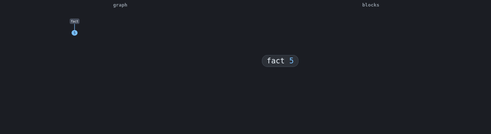

# MeTTa TS

MeTTa TS is a metagraph rewriting database, written in pure TypeScript. You store facts in a space, query them by pattern, and compute by writing rewrite rules over the same facts, all with the same pattern-matching mechanism.

A metagraph is the most expressive of the graph data models. A graph joins two nodes with an edge, a hypergraph joins any number of nodes, and a metagraph lets links contain other links, so a fact can be about another fact: `(Believes Tom (parent Bob Ann))` is a statement whose subject is itself a statement. Rules live in the space as atoms too, so you compute by rewriting the data itself, and a program can query and rewrite its own rules.

The core engine runs anywhere TypeScript runs: the browser, Node, Deno, Bun, edge and serverless functions, and inside TypeScript-based AI agents. No native addons, no required WASM, no Rust. MeTTa (Meta Type Talk) is the language of OpenCog Hyperon, and MeTTa TS is a faithful port of its interpreter, but you do not need to know Hyperon to use it.

<p align="center">
  
</p>

<p align="center"><em>The factorial <code>(fact 5)</code> reducing to <code>120</code>, two ways in <a href="packages/grapher">MeTTaGrapher</a>: a node graph on the left, nested blocks on the right, playing in step. The whole interpreter runs in the browser.</em></p>

## Install

```bash
npm install @metta-ts/core        # the interpreter (works in any JS runtime)
# or: pnpm add @metta-ts/core  /  yarn add @metta-ts/core
```

Other packages, add as needed:

```bash
npm install @metta-ts/hyperon     # a Python-hyperon-style class API
npm install @metta-ts/edsl        # a typed TypeScript eDSL for building MeTTa
npm install @metta-ts/node        # CLI + file import! + a parallel matcher
npm install @metta-ts/browser     # web entry + in-memory virtual file system
npm install @metta-ts/libraries   # PeTTa standard libraries (auto-loaded by node/hyperon/browser)
npm install @metta-ts/py          # optional Python interop: pythonia or Pyodide
npm install @metta-ts/prolog      # optional Prolog interop: SWI native or SWI-WASM
npm install @metta-ts/grapher     # visual editor + browser or Node reduction GIFs
npm install @metta-ts/debug       # debugger engine (trace + why); the metta-debug CLI ships in @metta-ts/node
```

For the command-line runner, install `@metta-ts/node` globally (or use `npx`):

```bash
npm install -g @metta-ts/node
metta-ts path/to/program.metta

# without a global install:
npx -p @metta-ts/node metta-ts path/to/program.metta
```

### Experimental channel

A prerelease line ships ahead of stable on the `experimental` npm dist-tag. It
carries the in-progress Minimal MeTTa runtime and the Grounded V2 operation
protocol: owned, pull-based answer streams with per-answer binding deltas and
effects, and `MeTTa.registerStreamingOperation` on the runner. Opt in per package
with the tag:

```bash
npm install @metta-ts/core@experimental
npm install @metta-ts/hyperon@experimental
```

A plain `npm install @metta-ts/core` stays on the stable `latest` tag. The
experimental surface may still change before it lands in a stable release; see the
[`experimental` branch](https://github.com/MesTTo/MeTTa-TS/tree/experimental) and
the [1.2.0-experimental.0 notes](https://github.com/MesTTo/MeTTa-TS/releases/tag/v1.2.0-experimental.0).

## Quick start

Run MeTTa source from TypeScript with the core package:

```ts
import { runProgram, format } from "@metta-ts/core";

const results = runProgram(`
  (= (fact $n) (unify $n 0 1 (* $n (fact (- $n 1)))))
  !(fact 5)
`);

for (const { query, results: rs } of results) {
  console.log(format(query), "=>", rs.map(format));
}
// (fact 5) => [ '120' ]
```

`runProgram` parses the source, adds every non-bang atom to the knowledge base, evaluates each `!`-query, and returns one result group per query.

## Calling TypeScript from MeTTa

The `@metta-ts/hyperon` package is a class API modeled on Python's `hyperon`, but TypeScript-native: no Python, no Rust, no FFI. A grounded operation is a TypeScript function the evaluator can call by name.

```ts
import { MeTTa, ValueAtom, type GroundedAtom, type Atom } from "@metta-ts/hyperon";

const metta = new MeTTa();

metta.registerOperation("double", (args: Atom[]) => {
  const n = (args[0] as GroundedAtom).jsValue<number>();
  return [ValueAtom(n * 2)];
});

console.log(metta.run("!(double 21)")[0].map(String)); // [ '42' ]
```

A thrown error becomes a MeTTa `(Error ...)` atom the program can inspect, rather than crashing the run.

## Calling into JavaScript

Grounded operations let MeTTa call functions you register by name. The interop layer goes one step further: it lets MeTTa reach into the host runtime itself, calling global functions and methods and building JavaScript values, with no glue code. Enable it with `registerJsInterop`.

```ts
import { MeTTa, registerJsInterop } from "@metta-ts/hyperon";

const metta = new MeTTa();
registerJsInterop(metta);

metta.run(`!((js-atom "Math.max") 3 7 2)`); // [ '7' ]             resolve and call a global
metta.run(`!((js-dot "hello world" "toUpperCase"))`); // [ '"HELLO WORLD"' ] call a method on a value
metta.run(`!((js-dot (js-list (5 1 3)) "join") "-")`); // [ '"5-1-3"' ]       build a JS array, then join it
```

## Async MeTTa

MeTTa can be asynchronous. A grounded operation can do I/O (a fetch, a database query, a timer) and the evaluator awaits it. Register it with `registerAsyncOperation` and run with `runAsync`. A synchronous program gives identical results either way.

```ts
import { MeTTa, ValueAtom } from "@metta-ts/hyperon";

const metta = new MeTTa();
metta.registerAsyncOperation("fetch-temperature", async () => {
  const res = await fetch("https://example.com/temp"); // any real I/O
  return [ValueAtom(await res.json())];
});

const out = await metta.runAsync("!(fetch-temperature)");
console.log(out[0].map(String));
```

## Concurrency and parallelism

Because the host is JavaScript, MeTTa branches can overlap real I/O and, for CPU-bound work, run across cores. `par` evaluates branches concurrently, `race` returns the first to finish and cancels the losers, `with-mutex` serialises a critical section, and `transaction` commits a body's space mutations only on success.

```ts
import { MeTTa, type GroundedAtom } from "@metta-ts/hyperon";

const metta = new MeTTa();
metta.registerAsyncOperation("aw", async (args) => {
  await new Promise((r) => setTimeout(r, (args[0] as GroundedAtom).jsValue<number>()));
  return [args[0]];
});
// race: the 3 ms branch wins; the 40 ms branch is cancelled
console.log((await metta.runAsync("!(race (aw 40) (aw 3))"))[0].map(String)); // [ '3' ]
```

`(once (hyperpose …))` goes further: on the Node runner it evaluates the branches on worker threads, so synchronous compiled loops run on separate CPU cores. Run it with the CLI (`metta-ts primes.metta`) and the one cheap branch settles first, before the expensive ones finish:

```metta
!(once (hyperpose ((prime? 535372570000000063)     ; expensive
                   (prime? 5421844300001)           ; cheap
                   (prime? 547344310000000013))))   ; -> True
```

## Ergonomic typed eDSL

For writing MeTTa in idiomatic TypeScript, [`@metta-ts/edsl`](packages/edsl) mints symbols, functors, and logic variables from proxies (`names()`, `vars()`), builds the special forms with capitalized combinators (`If`, `Case`, `Match`, arithmetic, ...) or a tagged template, and bridges TypeScript functions in both directions. It builds ordinary atoms and runs on the same engine, so you get MeTTa's full semantics: rewrite rules, nondeterminism, pattern matching, and types. Any TypeScript value drops in as a grounded atom automatically.

```ts
import { mettaDB, names, vars, If, gt, mul, sub, m } from "@metta-ts/edsl";

const db = mettaDB();

// `names()` mints symbols and functors, `vars()` mints logic variables. No name is written twice:
// the JS binding IS the name. A bare name grounds to its symbol; a called name applies it.
const { Likes, fact, Ada, Coffee, Chocolate } = names();
const { thing, x } = vars();

// Facts + a match query. With no explicit vars, the row keys are inferred from the pattern.
db.add(Likes(Ada, Coffee), Likes(Ada, Chocolate));
db.query(Likes(Ada, thing)); // [{ thing: "Coffee" }, { thing: "Chocolate" }]

// Recursive rewrite rule + grounded arithmetic.
db.rule(fact(x), If(gt(x, 0), mul(x, fact(sub(x, 1))), 1));
db.evalJs(fact(5)); // [120]

// Grounded functions, both directions: a plain typed function in, a MeTTa function out.
db.fn("balance-of", (a: { balance: number }) => a.balance);
db.evalJs(m`(balance-of ${{ owner: "Tom", balance: 100 }})`); // [100]
db.call.fact(5); // [120]
const factorial = db.import<[number], number>("fact"); // typed callable, factorial(6) === 720
```

The eDSL also has dependency-free helper subpaths for optional host interop:
`@metta-ts/edsl/py` builds `py-call`, `py-atom`, and collection forms, while
`@metta-ts/edsl/prolog` builds `prolog-call`, `Predicate`, and
`import_prolog_function`. These helpers only build atoms. You still opt into the
runtime through `@metta-ts/py` or `@metta-ts/prolog`.

```ts
import { vars } from "@metta-ts/edsl";
import { pyCall } from "@metta-ts/edsl/py";
import { prologCall } from "@metta-ts/edsl/prolog";

const { x } = vars();

pyCall("math.add", 40, 2); // (py-call (math.add 40 2))
prologCall(["edge", "alice", x]); // (prolog-call (edge alice $x))
```

## Python and Prolog interop

Host interop is explicit. A normal MeTTa run never loads Python or Prolog. When
you pass a host adapter, MeTTa source can import host files and call them through
ordinary MeTTa atoms.

Node:

```bash
metta-ts --py program.metta       # needs pythonia and python3
metta-ts --prolog program.metta   # needs swipl on PATH
```

Browser:

```ts
import { createBrowserRunner, createBrowserTextLoader } from "@metta-ts/browser/host";
import { createPyodideInterop } from "@metta-ts/py/pyodide";
import { createSwiWasmInterop } from "@metta-ts/prolog/swi-wasm";

const files = new Map([
  ["math.py", "def add(a, b):\n    return a + b\n"],
  ["facts.pl", "edge(alice, bob).\nedge(alice, mars).\n"],
]);
const loadText = createBrowserTextLoader({ files, baseUrl: import.meta.url });
const runner = createBrowserRunner({
  files,
  interops: [await createPyodideInterop({ loadText }), await createSwiWasmInterop({ loadText })],
});

await runner.run(`
  !(import! &self "math.py")
  !(py-call (math.add 40 2))
  !(import! &self "facts.pl")
  !(prolog-call (edge alice $x))
`);
```

The Prolog surface follows PeTTa's `Predicate`, `callPredicate`, `prolog-call`,
and `import_prolog_function` forms where they are independent of PeTTa's own
evaluator. MeTTa TS does not add a PeTTa mode or a curry mode.

More runnable examples are in [`examples/`](examples/): [`quickstart.ts`](examples/quickstart.ts), [`grounded-ops.ts`](examples/grounded-ops.ts), [`async.ts`](examples/async.ts), [`edsl.ts`](examples/edsl.ts), plus `.metta` source files. Run one with `npx tsx examples/quickstart.ts`.

## Connecting to a Distributed AtomSpace

A space does not have to be in memory. [`@metta-ts/das-client`](packages/das-client) connects to SingularityNET's **Distributed AtomSpace (DAS)** ([singnet/das](https://github.com/singnet/das)), a remote, shared atomspace, and presents it as a `Space` you query like any other. A DAS query is a network round-trip, so it is asynchronous; `matchAsync` is the async analogue of `(match space pattern template)`.

```ts
import { DasLiveSpace, matchAsync } from "@metta-ts/das-client";
import { sym, expr, variable } from "@metta-ts/core";

const A = (...xs) => expr(xs);

// connect to a running DAS (a Query Agent over gRPC)
const das = new DasLiveSpace(/* connection */);

// "which concepts are animals?" against the remote knowledge base
const animals = await matchAsync(
  das,
  A(sym("EVALUATION"), A(sym("PREDICATE"), sym("is_animal")), A(sym("CONCEPT"), variable("C"))),
  variable("C"),
);
console.log(animals.map(String));
// monkey human triceratops earthworm chimp ent rhino snake
```

This has been run end to end against a live DAS cluster (see [`@metta-ts/das-client`](packages/das-client) for the setup). The same atom handles MeTTa TS computes match the AtomDB byte for byte, so a TypeScript program, in Node today and the browser through [`@metta-ts/das-gateway`](packages/das-gateway), can query the same distributed knowledge base the Rust and Python agents use.

## What is implemented

A faithful port of hyperon-experimental's minimal interpreter (the nondeterministic stack machine), with the standard library loaded as MeTTa source on top. The core passes **all 270 assertions** of Hyperon's oracle corpus: the full dependent-type tier (GADTs, dependent types, types-as-propositions), spaces and mutable state, nondeterminism, grounded operations, and documentation. Correctness is also cross-checked against [LeaTTa](https://github.com/MesTTo/LeaTTa), the machine-checked (Lean 4) MeTTa semantics, pinned to the same commit.

Beyond the core: transactions, async evaluation, concurrency primitives (`par`, `race`, `once`, `hyperpose`, `with-mutex`), clause indexing that scales matching to millions of atoms, a flat interned knowledge base with a worker-thread parallel matcher, and a JavaScript interop layer (`js-atom`, `js-dot`, `js-list`, `js-dict`) that calls into the host runtime directly.

Eight PeTTa standard libraries load on demand with `(import! &self <name>)`, kept off the prelude so they leave default behavior unchanged: `vector`, `roman`, `combinatorics`, `patrick`, `datastructures`, `spaces`, and the `nars` and `pln` reasoners. The core list operations `size-atom`, `map-atom`, `filter-atom`, and `foldl-atom` run in linear time on a constant native stack.

The language engine is pure TypeScript. The core builds to a single ESM bundle
(~23 KB gzipped) that runs in Node and the browser with no native addon and no
required WASM. Optional host adapters are separate packages: Pyodide and
SWI-WASM are only pulled into browser bundles that import their adapter subpaths.

```bash
pnpm install
pnpm build
pnpm test          # 270/270 Hyperon oracle gate + unit and property tests
node packages/node/dist/cli.js examples/factorial.metta
```

## Packages

| Package                                         | What it is                                                                                    |
| ----------------------------------------------- | --------------------------------------------------------------------------------------------- |
| [`@metta-ts/core`](packages/core)               | The interpreter, parser, type system, and standard library. Zero platform dependencies.       |
| [`@metta-ts/hyperon`](packages/hyperon)         | A TypeScript class API over the core, modeled on Python's `hyperon`.                          |
| [`@metta-ts/edsl`](packages/edsl)               | An ergonomic, typed eDSL: term builders, special-form combinators, and a tagged template.     |
| [`@metta-ts/node`](packages/node)               | The `metta-ts` CLI, file `import!`, and a `SharedArrayBuffer` worker-thread parallel matcher. |
| [`@metta-ts/browser`](packages/browser)         | Browser entry point with an in-memory virtual file system for `import!`.                      |
| [`@metta-ts/py`](packages/py)                   | Optional Python interop: PeTTa's `py-call` and Hyperon's `py-atom`, over pythonia or Pyodide. |
| [`@metta-ts/prolog`](packages/prolog)           | Optional Prolog interop: PeTTa-compatible predicate calls over SWI-Prolog or SWI-WASM.        |
| [`@metta-ts/grapher`](packages/grapher)         | MeTTaGrapher: a visual editor with browser and headless Node reduction-GIF rendering.         |
| [`@metta-ts/das-client`](packages/das-client)   | Optional client to SingularityNET's Distributed AtomSpace via a Connect gateway.              |
| [`@metta-ts/das-gateway`](packages/das-gateway) | Optional transport-agnostic gateway bridging the browser to a Distributed AtomSpace.          |

## Performance

The pure-MeTTa path stays TypeScript throughout, with no escape to native code,
and is still fast: a functor-and-argument-keyed query over a 1,000,000-atom
knowledge base resolves in about 0.2 to 1.4 ms.

On the reproducible corpus benchmark
([`corpus-bench.mjs`](packages/node/bench/corpus-bench.mjs) runs the PeTTa
example corpus through both engines and checks each program’s `(test …)`
assertions), MeTTa TS passes all 98 Hyperon-faithful shared programs and is
**faster than PeTTa on every one**, median 1.55x, from pure TypeScript.

The core list operations run in linear time. `size-atom`, `map-atom`,
`filter-atom`, and `foldl-atom` over N elements are O(N) on a constant native
stack, byte-identical to the prelude recursion up to variable renaming, and beat
PeTTa 2.7x to 5.2x at N=100000.

The full per-program tables, memory figures, and the nondeterminism and
bounded-backward-chaining benchmarks are in
[`RESULTS.md`](packages/node/bench/RESULTS.md),
[`RESULTS-corpus.md`](packages/node/bench/RESULTS-corpus.md), and
[`RESULTS-listops.md`](packages/node/bench/RESULTS-listops.md). Each
release’s notes in [`RELEASE_NOTES.md`](RELEASE_NOTES.md) describe the engine
work behind that version’s numbers.

## Compared with DataScript

DataScript is the standard immutable in-browser database. The two differ first in the data model:

|                      | DataScript                                         | MeTTa TS                                                                                  |
| -------------------- | -------------------------------------------------- | ----------------------------------------------------------------------------------------- |
| Data model           | Flat entity-attribute-value datoms, a triple store | Metagraph: atoms nest, so a fact can be about another fact                                |
| Code and data        | Queries and rules sit outside the datoms           | Rules are atoms in the same space; a program can query and rewrite its own rules          |
| Computation          | Datalog query and `pull` over relations            | Term rewriting with nondeterministic evaluation; querying and computing are one mechanism |
| Types                | Attribute schema: cardinality, refs, uniqueness    | Optional gradual dependent types: GADTs, dependent types, types as propositions           |
| Host code in a query | None                                               | Grounded TypeScript calls inside rules, including async I/O and concurrency               |

On DataScript's own workloads (120,000 edge records, five isolated Node processes per engine,
medians, every result cross-checked between engines before timing), MeTTa TS 1.5.0 wins every
declarative query at both tested sizes and under uniform and skewed distributions:

| Workload, 120k records, uniform | DataScript 1.7.8 | MeTTa TS |         Winner |
| ------------------------------- | ---------------: | -------: | -------------: |
| Source lookup, declarative      |         14.14 ms | 0.011 ms | MeTTa TS 1349x |
| Reverse lookup, declarative     |          4.25 ms | 0.010 ms |  MeTTa TS 422x |
| Group lookup, declarative       |         14.47 ms |  1.72 ms |  MeTTa TS 8.4x |
| One-percent range, declarative  |         42.32 ms |  2.08 ms | MeTTa TS 20.3x |
| Anchored two-hop join           |         26.14 ms |  0.14 ms |  MeTTa TS 184x |
| Count all edges                 |        114.31 ms | 0.002 ms |       MeTTa TS |
| Triangle join count             |          3101 ms |  1079 ms |  MeTTa TS 2.9x |
| Bulk build                      |         385.9 ms | 322.6 ms | MeTTa TS 1.20x |
| Retained heap after build       |         48.8 MiB | 36.5 MiB | MeTTa TS 1.34x |
| Peak process RSS                |         2493 MiB | 2037 MiB | MeTTa TS 1.22x |
| Immutable insert, 1000 records  |          43.4 ms |  11.6 ms | MeTTa TS 3.75x |

DataScript keeps its direct index APIs on microsecond point reads: entity by id (~1.9x), the
`index_range` seek (its ordered-index specialty, ~118x over MeTTa's declarative range), the
bound-value `datoms` seeks (within about 2x and noisy between sessions), and every cold first
call on point rows, where MeTTa TS pays JIT warmup. Every MeTTa TS number comes from the default
configuration, and each routing path behind them is differential-gated byte-identical to the
reference evaluator, including result order.

## Provenance

- **Semantics:** [hyperon-experimental](https://github.com/trueagi-io/hyperon-experimental), pinned to commit `3f76dc4`.
- **Verified spec and differential oracle:** [LeaTTa](https://github.com/MesTTo/LeaTTa) (Lean 4).
- **Host interop surfaces:** PeTTa-compatible Python and Prolog call forms where they do not depend on PeTTa's evaluator.
- **Distributed AtomSpace:** optional client to SingularityNET DAS via a Connect gateway (Node), reachable from the browser.

## License

[MIT](LICENSE).
